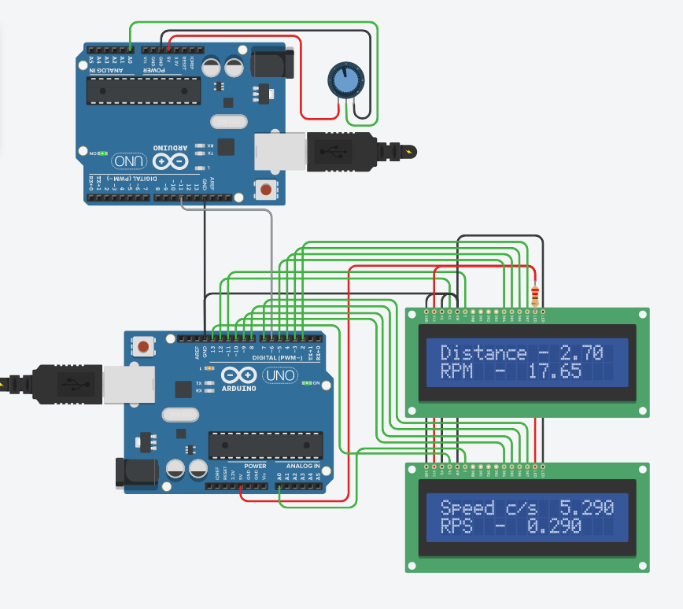

# distance_speed_arduino
calculation of distance and speed with wheel encoder using arduino which is made in tinkerCAD
## Problem statement: 
Calculate the speed and distance covered by a wheel using wheel encoder sensor and LCD display.
In the simulation, due to lack of resources we are using another Arduino for sending the input what the encoder would send. 

### Components required:
1. Arduino Uno R3
2. 16 x 2 lcd display
3. Battery
4. Jumper wires
5. Rotary encoder ( / Arduino for Simulating encoder)

### Diagram:

### Working Principle: 

When the rotary encoder rotates it sends pulses to the Arduino. Arduino identifies the rotation and direction(clockwise/anticlockwise) of the wheel. Arduino counts the pulses and computes the speed and distance using mathematical formulas(calibrated) and displays to the lcd display.

In the rotary encoder conductors are placed in a disc and connected to a common pin in a circular fashion. Encoders have 2 output pins and when it rotates it gives zero and one. The pattern of zeros and ones gives us information about the speed, distance and direction of the rotation.

### Calibration:

The rotary encoder gives information about the rotations but we have to use the below mentioned mathematical formulas to calculate the distances.

Distance travelled in one rotation  = 2 x π x r

Distance travelled in one step = 2 x π x r / N,
	where N is the number of spikes in the rotary encoder.

Since we don’t have the wheel encoder we have decided to go with an arduino to generate the signals which the wheel encoder would produce.

### Code [arduino code](es_project1.ino)

For the simulation we are using 2 arduino boards. One for giving simulated values to the other Arduino acting as if it was a rotating wheel with an encoder embedded in it. The second Ardiono would receive values from the first and compute the distance travelled, rotations per second and speed and display it in the led.

For the LCD display we have used the liquidcrystal.h header file

The main loop() function runs again and again. Inside that we are computing the current time in milliseconds using millis() function and storing it in current_time.

Temp is the value that is received from the first arduino as the encoder output using the digitalRead(encoder) function . The encoder variable comes from the first arduino.

Calculation of the time difference between successive pulses:

This is done using the if(temp == 0) condition check. For every consecutive pulse we enter this if block.
We compute the time difference using diff = current_time - prev_time
Difference of time = Current time - previous recorded time.
This would update the time difference after each pulse received. Then we update the prev_time, using the formula prev_time = current_time.

After updating the diff variable, we compute rotations per second.

We know the time it takes for 1 pulse. 20 pulses make 1 rotation.

Time for 1 pulse = diff

Number of rotations per second = 10e3 / (20 * diff)
This is stored in the rps variable.
The speed would be modified using the formula:
Speed = rps * 2 * π * r cm/s,
Where r is radius of wheel in cm
The distance would be modified using the formula:
distance =  distance + diff * rps * 2 * π * r cm
Then we print the computed values.
